Efficiency in CI resources is crucial for fast-moving projects. A two-step CI
approach allows developers to prioritize and sequence tests based on their
importance and the stage of the PR.

Running all tests on every PR might be exhaustive and time-consuming. It can
also drain CI resources, especially if the full suite involves comprehensive,
heavy, or time-intensive tests. Instead, separating tests into two distinct
groups can be beneficial:

1. **Preliminary Tests**: These are the tests you run on every PR preliminary
   after they're created or updated, usually encompassing code linters and
   essential unit tests that are faster and critical to ensuring basic
   functionality.

2. **Pre-Merge Tests**: Before merging a pull request, a more comprehensive set
   of tests (including functional tests, integration tests, and perhaps some
   performance tests) are run to ensure robustness. These tests might be
   lengthier and more resource-intensive.

```dot class="graph"
strict digraph {
    fontname="sans-serif";
    rankdir="LR";

    node [style=filled, shape=rect, fontcolor="black", fontname="sans-serif";];
    edge [color="black", arrowhead=none, fontname="sans-serif", arrowhead=normal];

    open [label="PR opened\nor updated", fillcolor="#57AB5A"];
    queued [label="PR queued", shape=oval];

    preliminary [label="Preliminary tests", fillcolor="#DCAB07", fontcolor="white"]
    preliminary_fail [label="Preliminary\nfailure", fillcolor="red", fontcolor="white"]
    preliminary_ok [label="Preliminary\nsuccess", fillcolor="#57AB5A"]

    premerge [label="Pre-merge tests", fillcolor="#DCAB07", fontcolor="white"]
    premerge_fail [label="Pre-merge\nfailure", fillcolor="red", fontcolor="white"]
    premerge_ok [label="Pre-merge\nsuccess", fillcolor="#57AB5A"]

    queue_req [label="Queue\naction/command", fillcolor="lightblue"]
    merged [label="Merge", fillcolor="#814edf", fontcolor="white"]


    open -> preliminary
    preliminary -> preliminary_ok;
    preliminary -> preliminary_fail;
    preliminary_ok -> queue_req;
    queue_req -> queued;
    queued -> premerge;
    premerge -> premerge_ok;
    premerge -> premerge_fail;
    premerge_ok -> merged;
}
```



By structuring CI this way, you get preliminary feedback on the PR's essential
aspects while ensuring a thorough check before the merge. This also aids in
conserving CI resources, as not all tests are run at every PR iteration.

With Mergify's merge queue, you can further optimize this process. If you're
[batching](batches) multiple PRs for a merge, instead of running the pre-merge
tests for each PR individually, you can run them once for the entire batch.
This can result in significant savings, especially when the pre-merge tests are
extensive.

```dot class="graph"
strict digraph {
    fontname="sans-serif";
    rankdir="LR";

    node [style=filled, shape=rect, fontcolor="black", fontname="sans-serif";];
    edge [color="black", arrowhead=none, fontname="sans-serif", arrowhead=normal];

    open [label="PR #1 opened\nor updated", fillcolor="#57AB5A"];
    open2 [label="PR #2 opened\nor updated", fillcolor="#57AB5A"];

    queued [label="PR queued", shape=oval];

    preliminary [label="Preliminary tests", fillcolor="#DCAB07", fontcolor="white"]
    preliminary_fail [label="Preliminary\nfailure", fillcolor="red", fontcolor="white"]
    preliminary_ok [label="Preliminary\nsuccess", fillcolor="#57AB5A"]

    preliminary2 [label="Preliminary tests", fillcolor="#DCAB07", fontcolor="white"]
    preliminary_fail2 [label="Preliminary\nfailure", fillcolor="red", fontcolor="white"]
    preliminary_ok2 [label="Preliminary\nsuccess", fillcolor="#57AB5A"]


    premerge [label="Pre-merge tests", fillcolor="#DCAB07", fontcolor="white"]
    premerge_fail [label="Pre-merge\nfailure", fillcolor="red", fontcolor="white"]
    premerge_ok [label="Pre-merge\nsuccess", fillcolor="#57AB5A"]

    queue_req [label="Queue\naction/command", fillcolor="lightblue"]
    queue_req2 [label="Queue\naction/command", fillcolor="lightblue"]


    merged [label="Merge PR #1", fillcolor="#814edf", fontcolor="white"]
    merged2 [label="Merge PR #2", fillcolor="#814edf", fontcolor="white"]


    open -> preliminary
    preliminary -> preliminary_ok;
    preliminary -> preliminary_fail;
    preliminary_ok -> queue_req;

    open2 -> preliminary2
    preliminary2 -> preliminary_ok2;
    preliminary2 -> preliminary_fail2;
    preliminary_ok2 -> queue_req2;
    queue_req2 -> queued;

    queue_req -> queued;
    queued -> premerge;
    premerge -> premerge_ok;
    premerge -> premerge_fail;
    premerge_ok -> merged;
    premerge_ok -> merged2;
}

```



## Configuration

To implement this with Mergify, you'll need to:

1. Configure your CI system to recognize the distinction between preliminary and
   pre-merge tests.

   This is typically done by configuring the CI to run all the preliminary tests
   on every branches, while pre-merge tests would only be run on branches
   created by the merge queue. Those branches are prefixed by
   `mergify/merge-queue/` by default (see `queue_branch_prefix` in
   [`queue_rules`](/configuration/file-format/#queue-rules)).

2. Configure Mergify to create a new branch for each pull request in the queue.

   By default, Mergify has an optimized behavior that does not always create a
   new branch for every PR in the queue. You need to set `allow_inplace_checks`
   to `false` in your queue definition inside the
   [`queue_rules`](/configuration/file-format/#queue-rules)) section.

3. Adjust your Mergify configuration to act based on the outcomes of these test
   groups.

   This is typically done by setting the right `queue_conditions` and
   `merge_conditions`. The former should include only the CI expected to enter
   the queue (the preliminary tests) while the later should list the
   pre-merge tests.

### GitHub Actions Example

To help visualize this, here's an example using GitHub Actions:

```yaml
name: CI

on:
  pull_request:
    branches:
      - main

jobs:
  unit-tests:
    runs-on: ubuntu-latest
    steps:
    - name: Checkout code
      uses: actions/checkout@v2

    - name: Run Unit Tests
      run: make unit-tests

  pre-merge-tests:
    if: startsWith(github.head_ref, 'mergify/merge-queue/')
    runs-on: ubuntu-latest
    steps:
    - name: Checkout code
      uses: actions/checkout@v2

    - name: Run Pre-Merge Tests
      run: make pre-merge-tests
```

In this setup, `unit-tests` will run for every PR, while `pre-merge-tests` will
only run for PRs that are in Mergify's merge queue.

Adjusting this approach to different CI systems will be based on their specific
syntax and triggers, but the general principle remains the same.

The Mergify configuration should looks like:

```yaml
queue_rules
  - name: default
    allow_inplace_checks: false
    queue_conditions:
      - check-success = unit-tests
    merge_conditions:
      - check-success = pre-merge-tests
```

Implementing a two-step CI ensures that resources are optimized, developers get
rapid feedback, and the code's robustness is assured before merging.
