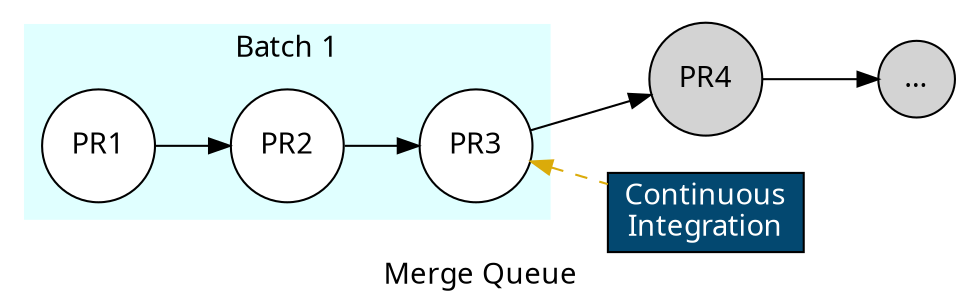
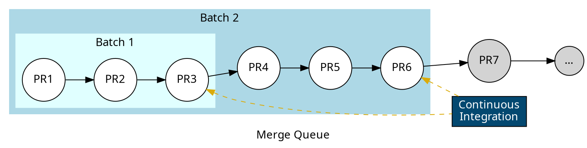

import { Screenshot } from "../../components/Images"
import batchesScreenshot from "../images/merge-queue/batches/batches-dashboard.png"
import { Success } from "../../components/Alerts/Success"

Mergify's batch merging feature is a powerful tool that enhances productivity
and efficiency in your development workflow. Instead of merging pull requests
one by one, which can be time-consuming, especially for larger projects, batch
merging allows you to combine and merge multiple pull requests at once.

The batch merging process works by setting a `batch_size` option on your merge
queue. This option determines the number of pull requests that Mergify will
combine into a single draft pull request. The draft pull request is then
validated by your Continuous Integration (CI) system. If the CI validation
passes, Mergify merges all the pull requests in the batch and closes the draft
pull request.

If a failure occurs, Mergify identifies the problematic pull request(s)
automatically and removes them from the queue, allowing the rest of the queue
to be processed as usual.

This feature is especially useful for large-scale projects with many pull
requests to merge, as it can significantly reduce the time required to merge
them all.

`video: https://www.youtube.com/watch?v=dc2_fZkJaVU`

## Understanding Batch Merging

Batch merging works by utilizing the `batch_size` option in your Mergify queue
configuration. This option tells Mergify how many pull requests it should try
to combine and validate at once. The `batch_size` can be adjusted according to
the needs of your project, with a higher number indicating a larger batch size.

For example, if you set `batch_size` to 3, Mergify will create a draft pull
request that includes the changes from the next three pull requests in the
queue. This draft pull request is then validated by your CI system. If all
checks pass, then the three pull requests included in the batch are deemed
ready to be merged.

```yaml
queue_rules:
  - name: default
    batch_size: 3
    ...
```



In case the draft pull request fails CI validation, it means one or more pull
requests in the batch have introduced changes that are causing the failure.
Mergify handles this scenario by using a binary search method to identify the
failing pull request. It does this by systematically reducing the batch size
and re-running the CI checks until it finds the problematic pull request. Once
found, the failing pull request is removed from the queue and the rest of the
pull requests are processed as usual.

This batch merging process allows multiple pull requests to be validated and
merged more efficiently than if they were handled individually.

## Configuring Batch Merging

Configuring batch merging involves adjusting your Mergify configuration file to
set the `batch_size` option according to your project's needs.

1. Open your [Mergify configuration file](/configuration/file-format).

2. Under `queue_rules`, set the `batch_size` option to the number of pull
   requests you want to be tested together in a batch.

```yaml
queue_rules:
  - name: default
    batch_size: 3
    ...
```

In the above example, batches of up to 3 pull requests will be created and
tested together.

<Screenshot src={batchesScreenshot} alt="Mergify merge queue with batches" />

You can configure the delay that Mergify will use to wait for the batch to be
filled up using the `batch_max_wait_time` option.

```yaml
queue_rules:
  - name: default
    batch_size: 5
    batch_max_wait_time: 5 min
    ...
```

With the configuration above, Mergify waits up to 5 minutes for 5 PR to enter
the queue before creating a batch. This allows you to pick the right trade-off
between latency and minimal CI usage.
## Batch Merging and Speculative Checks

Batch merging and speculative checks are two powerful features that work in
synergy to improve the efficiency of your merge queue.

Batch merging allows Mergify to test multiple pull requests together as a
single unit, reducing the amount of time waiting for individual pull request
tests to complete. On the other hand, [speculative checks](speculative-checks)
allow for multiple batches to be tested in parallel, further speeding up the
merge process.

When both these features are enabled, Mergify creates multiple batches of pull
requests (according to the `batch_size` option) and then runs tests on several
of these batches at the same time (as defined by the `speculative_checks`
option). If any pull request within a batch fails, [Mergify identifies the
culprit through a binary search, removes it from the queue, and continues
processing the rest of the queue](#handling-batch-failure).

```yaml
queue_rules:
  - name: default
    speculative_checks: 2
    batch_size: 3
    ...
```

In the above example, Mergify will create up to 2 batches, each containing up
to 3 pull requests, and test them in parallel.

Combining these two features allows you to optimize the throughput of your
merge queue. You can increase the batch size to merge more pull requests
concurrently, while also increasing the number of speculative checks to test
more batches in parallel. This minimizes idle time and makes full use of your
CI resources.

Suppose your queue has 7 pull requests waiting, and your CI pipeline takes
about 10 minutes to complete. If you set `batch_size` to 3 and
`speculative_checks` to 2, Mergify would create 2 batches, each containing 3
pull requests. These batches are then tested in parallel.



With this configuration, even if your CI time is 10 minutes, you can merge the
first 6 pull requests in only 10 minutes, as opposed to the 1 hour it would
typically take to test each pull request individually.

Check out our [performance page](performance) for more information.

## Handling Batch Failure

When a batch fails, Mergify does not remove all its pull requests from the
queue. Instead, it takes additional steps to identify the problematic pull
request and remove it from the queue.

This is how it works:

1. **Splitting the batch**: If a batch fails, all subsequent batches are deemed
   to fail as well, are canceled and put back into the queue. The system splits
   the failed batch to isolate the problematic pull request. The size of these
   new batches is determined by the `speculative_checks` parameter. By default,
   the batch is split into two; however, if `speculative_checks` is set to a
   value greater than 1, it dictates the number of batches the failed batch
   should be divided into.

2. **Testing the new batches**: After splitting, the first new batch is
   immediately retested, while others are queued. If `speculative_checks` is
   greater than 1, the system will also test subsequent batch split at the same
   time. This continues until the split is done.

3. **Handling the result**: If the first batch split succeeds, it is merged and
   the next split is scheduled for testing. If the batch fails, Mergify splits
   this batch, going back to step 1.

4. **Pin-pointing the failed batch**: If a batch contains only one pull request
   and still fails, it is deemed to be the culprit and is removed from the
   queue.

Note that this system is completely automatic and there is no need to
intervene. The number of maximum splits can be controlled by
[`batch_max_failure_resolution_attempts`](/configuration/file-format#queue-rules).

### Batch Failure Scenario Example

Let's assume that we have a batch of 6 pull requests: `[PR1 + PR2 + PR3 + PR4 +
PR5 + PR6]`. During the initial testing, Mergify first tests the batch with all
6 pull requests together.

As the batch fails, this could be due to any of the PRs or a specific
combination of them. Mergify learned that the combination
`[PR1 + PR2 + PR3 + PR4 + PR5 + PR6]` does not work; it now needs to test parts
of this combination.

With `speculative_checks` set to 3, the system will aim to split the batch into
3 parts:

- First part: `[PR1 + PR2]`
- Second part: `[PR1 + PR2 + PR3 + PR4]`
- Third part: `[PR1 + PR2 + PR3 + PR4 + PR5]`

<Success title="Remember">
  Mergify already tested `[PR1 + PR2 + PR3 + PR4 + PR5 + PR6]` in the
  original batch and knows it does not work. No need to test it again!
</Success>

The system will immediately retest the different parts since the number of
splits matches the number of speculative checks allowed.

If the first part `[PR1 + PR2]` passes, the system will merge it.

If the first part `[PR1 + PR2]` fails, the system will split it again and test
each PR individually, applying the algorithm again.

If there's a consecutive failure in the subsequent parts, the system will
continue to split and isolate the problematic PR(s) and retest until the split
contains a single pull request.

## Important Considerations

While using batch merging and speculative checks together can significantly
speed up your merge queue processing, it's crucial to consider the following
points for an optimal setup:

### Branch Protection Settings

Since pull requests are tested within temporary ones, the branch protection
setting `Require branches to be up to date before merging` needs to be
disabled. If your team requires a linear history, you can set the queue option
`merge_method: rebase`.

This does not mean that Mergify will test outdated PRs, but it will merge the
original pull requests once its speculative checks are finished. The original
PR won't be up-to-date according to GitHub, which means using this setting
would block the merge.

### Queued PR Changes

Remember that changes to PRs or the queue can disrupt the batch process. If a
PR is updated or changed in a way that it no longer meets the `queue_rules`, it
will be removed from the queue, and the order of checks will be updated. In
such cases, the process resets, and the remaining PRs are rechecked in their
new order.

### Transferring Labels

import LabelCopier from  './_mergify-merge-queue-labels-copier.mdx'

<LabelCopier />
