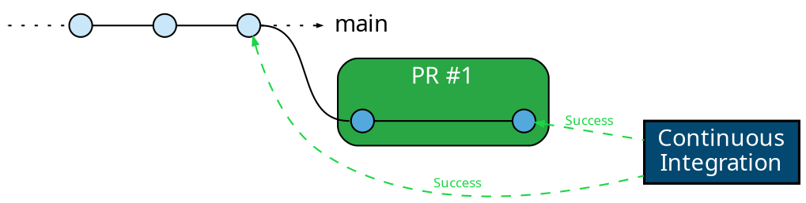
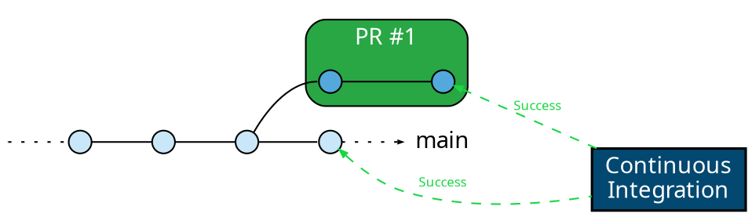
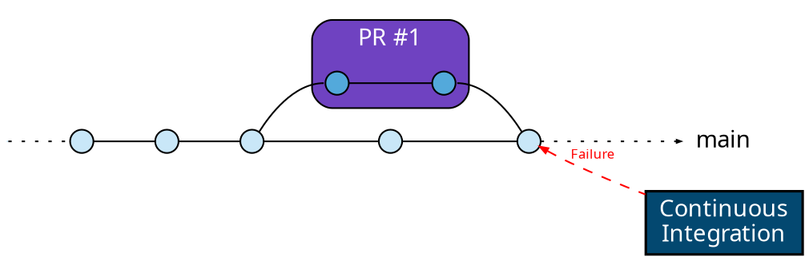
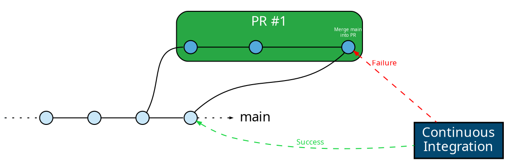
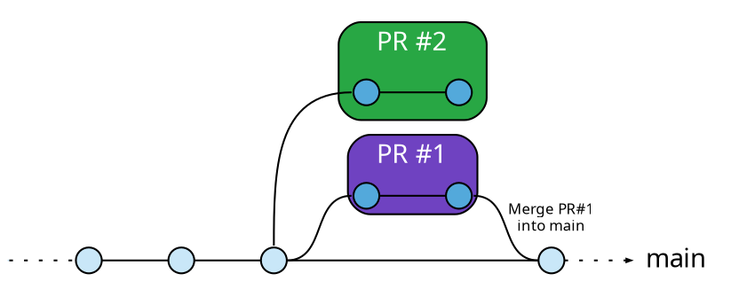
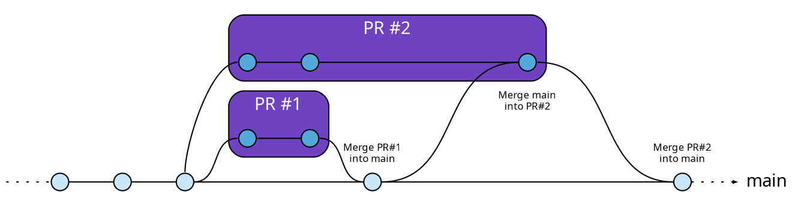

Development workflows can often be complex, with multiple developers
collaborating on a single codebase. This leads to multiple pull requests that
need to be merged in a specific order to ensure code stability and
compatibility. In this context, merge queues are an essential tool.

A merge queue is a mechanism to manage and control the order of merging pull
requests into the main branch of your repository. It helps streamline the
development process, reduce merge conflicts, and maintain a healthy and stable
codebase.

In this guide, we will explore the concept of merge queues, their importance in
continuous integration and development workflows, and how Mergify's Merge Queue
can simplify and improve your development process.

Watch this video below or read this page to discover why a merge queue
is a key component of your development workflow.

`youtube: https://www.youtube.com/watch?v=6nHThSoFfVE`

## Why Do You Need a Merge Queue?

In modern software development, teams often work in parallel on multiple
features or bug fixes. This parallel work, although necessary for swift
development, poses a risk when changes are merged into the main branch.

Even with sophisticated CI/CD pipelines validating the correctness of each
change, a problem arises when multiple changes are ready to merge
simultaneously. While each change may be correct and compatible with the main
branch at the time it was last updated, merging one could introduce
incompatibilities with others that are also ready to merge.

This is the risk of merging pull requests that are not up-to-date with the main
branch: they may have been validated against an outdated version of the
codebase.

To mitigate this risk, engineers often find themselves in a race to update and
merge their pull requests before others do, leading to what we can call a
"merge war". This race not only distracts from productive development work but
also puts unnecessary pressure on engineers and creates an inefficient working
environment.

A merge queue addresses this issue by automatically ordering pull requests
ready to be merged, updating each one against the main branch, re-running
validations, and merging them only if they pass. This ensures that each change
is always up-to-date and validated against the real state of the main branch at
the time it's merged.

With a merge queue, there is no longer a need for engineers to participate in a
"merge war". The queue takes care of update and merge processes, allowing
engineers to focus on their core development tasks, while maintaining a steady,
efficient, and error-free integration flow.

### Understanding The Problem: A Real-world Example

Let's consider a situation with a having a pull request ready to merge.

#### Step 1: PR Passes CI

The developer made their changes on their feature branches. They've pushed
their changes, and their pull request have successfully passed all CI checks.
The CI pipeline has validated that their changes are compatible with the main
branch, and everything seems ready to merge.

#### Step 2: Main Branch Gets a New Commit

Meanwhile, a second developer merges another change into the main branch. This
change doesn't conflict with the previous pull request at the code level, so
GitHub still marks them as safe to merge.

What's not seen here, is that the new commit on the main branchhave caused a
change in the behavior of the code that makes the changes in our developer's PR
incompatible.

**This could be anything**: a new linter check has been added, a functional
test has been added and won't pass with this new code, a file or a component
has been renamed, etc.

#### Step 3: Merging the PR Would Fail the CI

If the pull request gets merged now, it will create a failure in the main
branch because its changes are not compatible with the latest commit from the
main branch. The CI system couldn't know about this, because it validated the
developer's pull request against the previous main branch commit, and not the
latest.

Despite the CI check, the main branch now has a failure because the CI could
not anticipate the effect of the latest changes on the changes in the
developer's pull request.

**This scenario breaks the main branch.** This could prevent any deployment of
the code and will make any pull request created from this latest commit to not
pass the CI, blocking the entire development team until the situation is
manually addressed by an engineer.

This example demonstrates **the risk of merging pull requests that are not
up-to-date with the main branch.** It's a common scenario in active development
teams, and it's exactly the kind of problem a merge queue is designed to
prevent.

### Solving the Problem Using a Merge Queue

A merge queue provides an effective solution to the problem described above.
Let's walk through the same example but this time using a merge queue.

After the developer's pull request have passed their initial CI checks, they're
added to the merge queue rather than being merged immediately.

Here's where the magic happens. The merge queue will now update the pull
request to include changes from the latest commits from the main branch,
creating a new temporary merge commit.

It then runs CI checks on this new merge commit. This ensures that the changes
in the pull request are compatible with the current state of the main branch,
not its state when the PR was originally created.

In our example above, this would catch the incompatibility problem and
**prevents the pull request to get merged and to break the main branch.** The
PR is therefore not merged and is returned to the developer for revision.

By always testing against the latest state of the main branch, a merge queue
helps to prevent broken main branches, maintaining the integrity of your
codebase and ensuring that your team can always deliver working software.

When multiple pull requests are mergeable, they are scheduled to be merged
sequentially, and are updated on top of each other. The pull request branch
update is only done when the pull request is ready to be merged.

That means that when a first pull request has been merged, and the second one
is outdated like this:

A merge queue will make sure the pull request #2 is updated with the latest tip
of the base branch before being merged:

## When to Use Merge Queues

Determining when to use a merge queue largely depends on your team's
development practices, the complexity of your project, and the rate of incoming
pull requests. Here are some common scenarios where a merge queue can be
beneficial:

- **High Volume of Pull Requests**: if your project is receiving a large number
of pull requests, it can be challenging to keep track of which PRs are ready
for merging and which ones need further checks or updates. A merge queue
automates this process, ensuring that only validated and up-to-date PRs are
merged.

- **Complex Projects**: for complex projects with multiple dependencies, a
small change can potentially have significant effects. Running updated CI
checks on each PR in a merge queue ensures that all changes are compatible with
the

- **Agile Teams**: teams that practice Agile methodologies such as continuous
integration and continuous deployment (CI/CD) can benefit significantly from a
merge queue. By automating the testing and merging process, a merge queue helps
maintain the pace of continuous delivery while ensuring code quality.

- **Teams with Varying Time Zones**: if your team members are distributed
across various time zones, coordinating PR reviews and merges can be tricky.
With a merge queue, PRs can be merged in an orderly manner as they pass checks,
regardless of who is currently online.

- **Prioritizing Important Pull Requests**: sometimes, you have important pull
requests that should be merged before others, irrespective of the order in
which they were created. With a merge queue, you can prioritize these important
PRs to be merged as soon as they pass their CI checks.

In summary, a merge queue can be a valuable tool for any team looking to
streamline their development process, improve code quality, and maintain a
healthy main branch. With Mergify's merge queues, you can automate this entire
process, making your team more productive and your project more robust.

## Benefits of Using Merge Queues

Merge queues offer a multitude of benefits that can greatly enhance the
efficiency and quality of your software development process. Here are some key
advantages:

- **Ensures Codebase Stability**: by merging only up-to-date and CI-checked
PRs, merge queues significantly reduce the risk of introducing bugs or
conflicts into your codebase, thus enhancing its stability.

- **Saves Time and Reduces Manual Labor**: merge queues automate the process of
testing and merging PRs, saving developers from the tedious task of constantly
updating and checking their PRs. This allows them to focus more on writing
quality code and less on administrative tasks.

- **Optimizes Resource Usage**: merge queues minimize the use of CI resources
by avoiding unnecessary checks on PRs that are not up-to-date with the main
branch. Usage of advanced options such as [batches](batches).

- **Enhances Collaboration**: merge queues promote a more collaborative
environment where developers don't need to compete to get their PRs merged.
Instead, they can confidently work knowing that their PRs will be handled
fairly and efficiently.

- **Streamlines Workflow**: by automatically handling PR updates and merges, a
merge queue streamlines the software development workflow. This makes the
process smoother, faster, and less prone to human error.

In essence, merge queues can significantly boost your team's productivity and
the quality of your product, making them a worthwhile addition to your
development toolbox.
