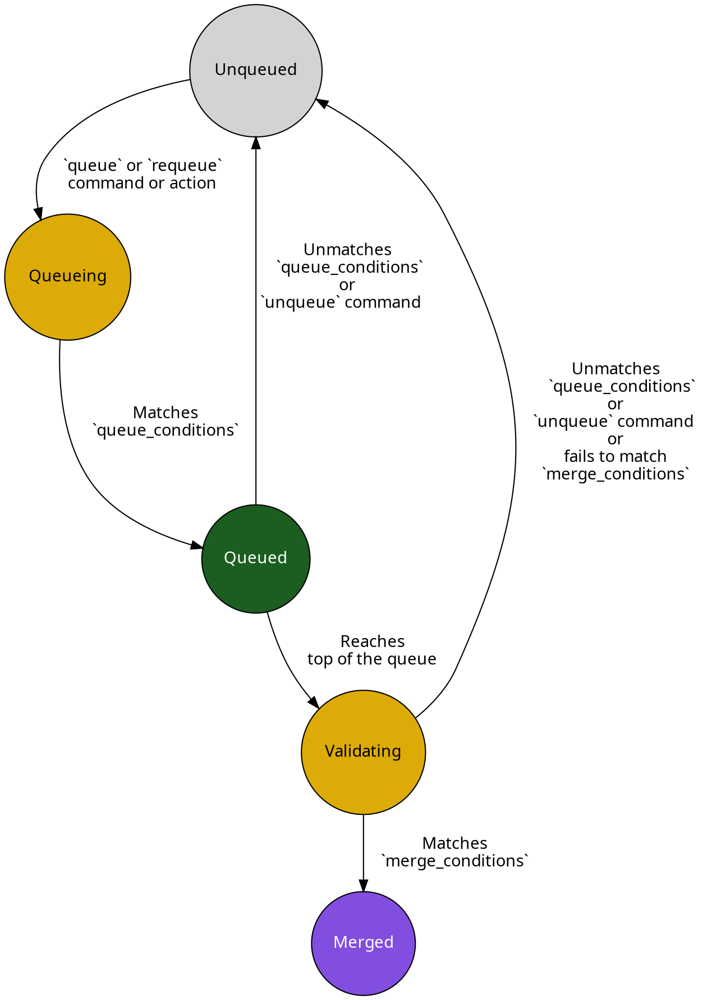

import { Screenshot } from "../../components/Images"
import queueCheckScreenshot from "../images/merge-queue/lifecycle/mergify-check.png"
import queueStatusScreenshot from "../images/merge-queue/setup/queue-status.png"

The merge queue in Mergify is a powerful tool for maintaining the integrity of
your codebase, ensuring that every Pull Request (PR) is up-to-date and passes
all necessary checks before being merged. But once a PR is added to a merge
queue, what exactly happens? Understanding the lifecycle of a PR in the merge
queue is essential for managing your PRs effectively and ensuring a smooth,
efficient workflow.

In this guide, we will walk you through the journey of a PR once it enters the
merge queue, from the moment it's added until it's either successfully merged
or removed from the queue. We'll also explain how to monitor and manage your
merge queue effectively, and share some best practices for handling common
scenarios such as requeueing and unqueueing PRs.

## Adding a Pull Request to the Merge Queue

{/* FIXME: add link to workflow automation */}

A pull request can be added to the merge queue either manually or through a
pull request rule using Mergify's workflow automation. Here's an overview of
the process:

1. **Manual addition:** A pull request can be manually added to the merge queue
   using the [`@mergifyio queue` command](/commands/queue).

{/* FIXME: add link to workflow automation below */}
2. **Automated addition:** A pull request can also be automatically added to
   the merge queue based on the rules defined in the `pull_request_rules`
   section of your [Mergify configuration file](/configuration/file-format).

3. **Meeting queue conditions:** Before a pull request can be added to the
   merge queue, it must meet certain conditions, specified under
   `queue_conditions` in your `queue_rules`. These conditions might include
   requirements such as passing all checks, having a certain number of approved
   reviews, or having specific labels.

4. **Entering the queue:** Once a pull request meets the specified queue
   conditions, it is added to the end of the merge queue. However, [priority
   rules](priority) can be used to alter its position in the queue.

Please note that, by default, only one pull request is processed at a time to
ensure that each pull request is tested against the most recent state of the
base branch. You can test multiple pull requests at once by using
[batches](batches) or in advance by using [speculative
checks](speculative-checks).

## Lifecycle of a Pull Request in the Merge Queue

The lifecycle of a pull request in the merge queue begins as soon as it enters
the queue.

{/* FIXME: add link to priority rules */}

1. **Position in the queue:** The pull request assumes its position in the
   queue based on the order in which it entered. As mentioned in the previous
   section, the order may be influenced by any defined priority rules.

2. **Waiting for its turn:** The pull request will wait in the queue until it
   is its turn to be processed. The processing of pull requests in the queue is
   sequential, which means that only one pull request is processed at a time by
   default.

3. **Validating the pull request:** When a pull request is next in line, it
   enters the validation phase. During this phase, the Mergify engine will
   update it with the base branch. But before the actual merge happens, it will
   check that the `merge_conditions` specified in the configuration file are
   satisfied. This ensures that only pull requests that meet the necessary
   conditions are merged.

4. **Merge success or failure:**

   - If the validation is successful, meaning all the `merge_conditions` are
     met, the pull request leaves the queue and is merged into the base branch.

   - If the merge is not successful, the pull request is removed from the
     queue. This could be due to various reasons, such as conflicts with the
     base branch or failure of some checks.

Remember that while a pull request is in the queue, its status and position can
be monitored, and if necessary, it can be manually requeued or unqueued — which
we will explore in the following sections.

## Validation Checks and Updates

When a pull request enters the merge queue, Mergify performs a series of
validation checks to ensure that the pull request is ready to be merged. These
checks are based on the `merge_conditions` specified in the [Mergify
configuration file](/configuration/file-format). The checks can include
verifying that required reviews are complete, certain labels are applied, the
build is successful, or any custom conditions that you've specified.

Before validating any of the `merge_conditions`, Mergify will update the pull
request with the latest changes from the base branch before attempting to
merge. This is done to ensure that the pull request is always up-to-date with
the base branch and that the merging will not introduce any conflicts. Mergify
uses the `update` action to achieve this by default, merging the base branch in
the pull request. You can change this behavior using the `update_method
option`.

{/* FIXME add link to queue configuration for update method */}

If the pull request cannot be updated due to conflicts that can't be resolved
automatically, it will be removed from the queue, and you will be notified to
manually resolve the conflicts and requeue the pull request.

In case any of the `queue_conditions` stop being true during the update,
Mergify will also stop the merge process. For example, if a new commit is
pushed to the base branch that makes a test on the pull request fail, the pull
request would be removed from the queue. In such situations, the issues need to
be addressed and the pull request has to be requeued once all checks pass
again.

This process ensures that your codebase is kept clean and that only fully
validated and up-to-date pull requests make it to your main branch.

## Removing a Pull Request from the Merge Queue

A pull request can be removed or "unqueued" from the merge queue in a couple of
ways:

1. **Non-compliance with `queue_conditions`:** If a pull request no longer
   meets the `queue_conditions` specified in the Mergify configuration file,
   it will automatically be removed from the queue. For instance, if one of the
   `queue_conditions` is the presence of a specific label, and that label
   gets removed from the pull request, Mergify will automatically remove the
   pull request from the queue.

{/* FIXME add link to commands */}

2. **Use of the `unqueue` command:** A pull request can be manually removed
   from the queue by issuing the `@mergifyio unqueue` command. This is
   particularly useful in situations where you need to stop a pull request from
   being merged, such as when a critical issue is discovered.

Please note, a pull request removed from the queue with the `unqueue` command
will not rejoin the queue automatically — it will need to be manually re-added
to the queue, either by re-applying the `queue` command or by re-satisfying the
`queue_conditions`.

These methods provide granular control over your merge queue, ensuring that
only the appropriate pull requests get processed and merged.

## Handling PRs that Fail Validation Checks

Even with all the automated checks and balances in place, it's possible for a
pull request to fail the validation checks. This could be due to a wide range
of issues, such as coding errors, conflicts with the base branch, failing CI
tests, or not meeting certain `merge_conditions`. When this happens, the pull
request is removed from the queue, and Mergify informs the pull request author
and reviewers about the failure.

Here's how to handle such situations:

1. **Review the failure reasons**: Mergify will provide a detailed report
   outlining why the pull request failed the checks. You should start by
   [reviewing these details to understand what went
   wrong](#monitoring-the-status-of-prs-in-the-merge-queue).

2. **Update the pull request**: Once you've identified the issue, the next step
   is to fix it. This might involve updating the code, resolving merge
   conflicts, or making other necessary changes to the pull request.

3. **Re-run the checks**: After updating the pull request, the validation
   checks need to be re-run. If you're using a continuous integration (CI)
   system, it will likely automatically run the checks again once the pull
   request is updated.

4. **Requeue the pull request**: Once all the issues have been resolved and the
   validation checks pass, the pull request needs to be requeued. You can do
   this by issuing the `@mergifyio queue` command.

By carefully addressing each failed check and ensuring all the issues are
fixed, you can maintain the integrity of your codebase while ensuring that
every pull request is ready to be merged when it's time.

## Requeuing a Pull Request in the Merge Queue

At times, you might find it necessary to requeue a pull request. This could
happen when a pull request is removed from the queue because it failed to meet
the `merge_conditions` of the queue it was in. This typically happens when a
check failed because a flaky test; the PR is
removed from the queue whereas it might have been mergeable.

In that case, the PR might be re-added to the merge queue to try again by
triggering the
`@mergifyio requeue` command, which will reset its status to a neutral state so
Mergify is happy to retry it.

To requeue a pull request, you can use the `@mergifyio requeue` command in the
pull request conversation. Once issued, the command will place the pull request
back in the merge queue according to the queue's `queue_conditions`.

On the other hand, if you manually unqueued a pull request using the
`@mergifyio unqueue`
command, you will need to use the `@mergifyio queue` command to put back the PR
in a queue matching its `queue_conditions`.

## Monitoring the Status of PRs in the Merge Queue

To keep track of the status and progress of your pull requests in the merge
queue, Mergify provides multiple tools and indicators. Here's how you can use
them:

1. **Check the Mergify dashboard:** The [Mergify
   dashboard](https://dashboard.mergify.com) provides a comprehensive view of
   your queues. You can see the number of pull requests in each queue and their
   position. You can access it by navigating to your repository on the Mergify
   dashboard and clicking on the "Queues" tab.

<Screenshot src={queueStatusScreenshot} alt="Mergify queue status" />

2. **Check the Mergify checks tab on the PR:** On each pull request page, the
   "checks" tab will show the status of the Mergify checks. If the pull request
   is in the queue, you will see a "Mergify — Queued" status.

<Screenshot src={queueCheckScreenshot} alt="Mergify check status" />

Monitoring your pull requests' status helps you understand their position in
the queue and estimate when they might be merged, making the entire process
more transparent and manageable.
