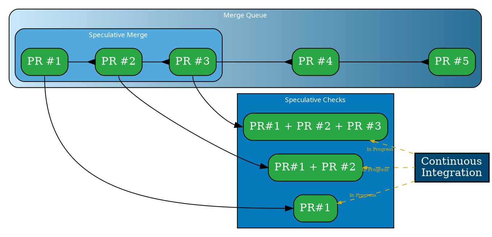

import { PrimaryLink } from '../../components/RelativeLink';
import { Info } from "../../components/Alerts/Info"
import { Warning } from "../../components/Alerts/Warning"
import { Screenshot } from "../../components/Images"
import specChecksDetailsScreenshot from "../images/merge-queue/speculative-checks/spec-checks-details.png"
import specChecksListScreenshot from "../images/merge-queue/speculative-checks/spec-checks-list.png"
import requiredPRbypassScreenshot from "../images/merge-queue/speculative-checks/mergify-required-pull-request-bypass.png"

In the context of software development, waiting for pull requests (PRs) to
merge one after another can be time-consuming, especially when each one needs
to pass through continuous integration (CI) pipelines. This is where
**Speculative Checks** come into play.

Speculative checks, as part of Mergify's queuing feature, facilitate the
simultaneous testing of multiple PRs to speed up the merging process. They test
a set of PRs together to ensure compatibility before committing them to the
main branch.

At its core, speculative checks aim to hasten the PR merging process by
proactively identifying potential merge conflicts or test failures, thereby
saving valuable development time. This introduction will guide you in grasping
the concept of speculative checks, their functionality, and the optimal way to
set them up.

## How Speculative Checks Work

The speculative checks functionality operates by grouping multiple pull
requests together based on their order in the queue and the
`speculative_checks` value set in your `queue_rules`. These PRs are then tested
together in a speculative manner, meaning they are combined and tested as if
they were going to be merged.

Consider a situation where you have 5 pull requests (PR #1 to PR #5) and
`speculative_checks` is set to 3. In this case, Mergify would create three
temporary PRs:

- Temporary PR #1: Combines PR #1
- Temporary PR #2: Combines PR #1 and PR #2
- Temporary PR #3: Combines PR #1, PR #2, and PR #3



These temporary PRs are created to facilitate parallel testing via your
continuous integration (CI) pipelines. The goal is to validate the merged
outcome of every PR in the queue in advance, ensuring they meet the
`queue_rules` merge conditions. If any of the PRs fails, it is removed from the
queue, identifying it as the source of the failure.

<Screenshot src={specChecksListScreenshot} alt="Mergify speculative checks" />

The result is an efficient PR processing workflow that ensures rapid and
successful merges while minimizing the risk of merge conflicts and test
failures.

<Screenshot src={specChecksDetailsScreenshot} alt="Mergify speculative checks details" />

<Info>

  Mergify does not merge the temporary draft PRs, but rather merges the
  original PR once they pass the speculative checks. It is possible to merge
  the draft PR themselves — see [Merging the Draft
  PRs](#merging-the-draft-prs).

</Info>

## Configuring Speculative Checks

Configuring speculative checks requires the use of the `speculative_checks`
setting in your `queue_rules`. The value for `speculative_checks` determines
the maximum number of PRs that can be embarked together for speculative
checking.

Here's a sample configuration:

```yaml
queue_rules:
  - name: default
    speculative_checks: 3
    merge_conditions:
      - "#approved-reviews-by>=2"
      - check-success=Travis CI - Pull Request
```

In the above example, Mergify will embark up to 3 PRs together for speculative
checking. Note that this doesn't mean that only 3 PRs will be in the queue — it
simply dictates the maximum number of PRs that can be scheduled together for
simultaneous testing.

Remember, speculative checks are optional and the use of this feature depends
on your specific project needs. You may need to adjust the `speculative_checks`
value depending on the CI resources available and the typical size and
complexity of PRs in your project.

## Merging the Draft PRs

By default, Mergify creates temporary branches for testing PRs with speculative
checks. However, the original PRs are the ones merged, not these temporary
branches. This ensures the integrity and traceability of the original pull
requests.

However, there might be scenarios where you want to merge the temporary
branches instead. One advantage of this is maintaining the same SHA1, which
might be important for some workflows and for traceability.

Mergify provides a setting called `queue_branch_merge_method` for this purpose.
By setting `queue_branch_merge_method` to `fast-forward`, Mergify will merge
the temporary branches instead of the original PRs. The default setting is
`none`, which means the temporary branches are not merged.

Here is an example configuration:

```yaml
queue_rules:
  - name: default
    speculative_checks: 10
    queue_branch_merge_method: fast-forward
    merge_method: merge
```

<Info>

  Please note that this setting only works if `merge_method` is set to `merge`.
  This is necessary so GitHub can mark the original PR as "merged" once the
  temporary branch is merged. This configuration makes sure that the original
  SHA1 from the PRs are included in the temporary branch and thus are detected
  as merged. Importantly, the final merged result is the exact SHA1 of what has
  been tested by CI, ensuring consistency and traceability.

</Info>

<Warning>

  If GitHub branch protections are enabled, fast-forward requires some
  additional configuration in branch protection settings, you also need to
  allow Mergify to "bypass the required pull requests" to merge.

  This is mandatory since Mergify pushes the temporary branch to the base
  branch without going through a pull request in order to keep the same SHA1.

  <Screenshot src={requiredPRbypassScreenshot} alt="Mergify bypass required pull requests" />

</Warning>

## Handling Issues with Speculative Checks

When speculative checks are underway, certain issues can lead to changes in the
way the PRs are being processed. Here's what happens in the event of various
issues.

### Failed Checks

If any of the embarked PRs fail the checks defined in `merge_conditions`, that
PR is removed from the queue. The checks are then re-run on the remaining PRs.

### Changes to Queue Rules or PRs

If an embarked PR no longer matches the `queue_conditions`, it is removed
from the speculative checks. Similarly, all PRs embarked after the removed PR
are also disembarked and re-embarked according to their new order in the queue.

This situation can occur when there are changes to the PR itself (such as a new
commit or a change in labels) or changes to the `queue_conditions`. In either
case, the queue is updated and the speculative checks process is restarted.

### New Commit on the Base Branch

If a new commit is pushed to the base branch while speculative checks are
underway, Mergify resets the process. The checks start over again with the
updated base branch. This ensures that the merged code will be up-to-date with
the latest version of the base branch.

In all these scenarios, the speculative checks process is dynamic and adjusts
itself to the changes, ensuring that the merged code meets the criteria defined
in the `queue_rules`.

## Advanced Tips and Best Practices

### 1. Use a High `speculative_checks` Value for Active Repositories

If your repository is very active with numerous pull requests being created and
merged regularly, consider setting a high `speculative_checks` value. This
allows more PRs to be tested in parallel, thereby speeding up the overall
merging process.

### 2. Optimize Your CI Pipeline

Speculative checks aim to reduce the overall merge time by parallelizing the
testing of multiple PRs. This, however, requires a robust CI/CD pipeline that
can handle multiple runs simultaneously. Optimizing your pipeline by reducing
test run time or increasing concurrent job limit can significantly improve the
effectiveness of speculative checks.

### 3. Pair with Priority Rules

When combined with [priority rules](priority), speculative checks become even
more powerful. You can define priority for PRs so that urgent ones are merged
faster, while the rest are tested speculatively in the background.

### 4. Review Your `queue_rules` Regularly

Regularly reviewing and updating your `queue_rules` can ensure your speculative
checks configuration is always aligned with your project's current needs and
workflow.

## Important Considerations

While speculative checks can greatly speed up the merging process, there are a
few important considerations to keep in mind when using this feature:

### Branch Protection Settings

Speculative checks operate by creating temporary pull requests, which merge
multiple PRs with the base branch. This process requires the branch protection
setting "Require branches to be up to date before merging" to be disabled.

This does not mean that Mergify will test outdated PRs, but it will merge the
original pull requests once its speculative checks is finished. The original PR
won't be up-to-date according to GitHub, which means using this setting would
block the merge.

### Parallel Checks Limit

You can set the number of parallel speculative checks by adjusting the
`speculative_checks` value in `queue_rules`. The number can range from 1 to 20,
depending on your requirements and available CI resources.

### Queued PR Changes

Remember that changes to PRs or the queue can disrupt the speculative checks
process. If a PR is updated in a way that it no longer meets the `queue_rules`,
it will be removed from the queue, and the order of checks will be updated. In
such cases, the process resets, and the remaining PRs are rechecked in their
new order.

## Troubleshooting Speculative Checks

### Problem: Continuous Integration Pipeline Isn't Triggered 

If your continuous integration pipeline isn't triggered when temporary pull
requests are created, check your CI system configuration. Make sure it is set
up to run on all pull requests, not just those targeting specific branches.

Branches created by Mergify are prefixed with `mergify/merge-queue/` by default
and can be change with the [`queue_branch_prefix`
settings](/configuration/file-format#queue-rules).

### Problem: Mergify Creates Temporary Pull Requests, But They Aren't Merged

Check the `queue_rules` merge conditions in your Mergify configuration. If
these conditions aren't met, Mergify won't be able to merge the temporary pull
requests.

### Problem: Merge Process is Slow Despite Speculative Checks

This could be due to various reasons. Your `speculative_checks` number might be
too low, causing fewer PRs to be tested together. Alternatively, your
continuous integration might be the bottleneck. Check the capacity of your CI
system; you might need to scale it up to handle the load from speculative
checks.

Remember, the primary goal of speculative checks is to reduce the overall time
to merge all PRs. It does not necessarily decrease the time to merge a single
PR.

For further issues, don't hesitate to contact the <PrimaryLink
href="mailto:support@mergify.com">Mergify support team</PrimaryLink> will be
glad to assist you.
